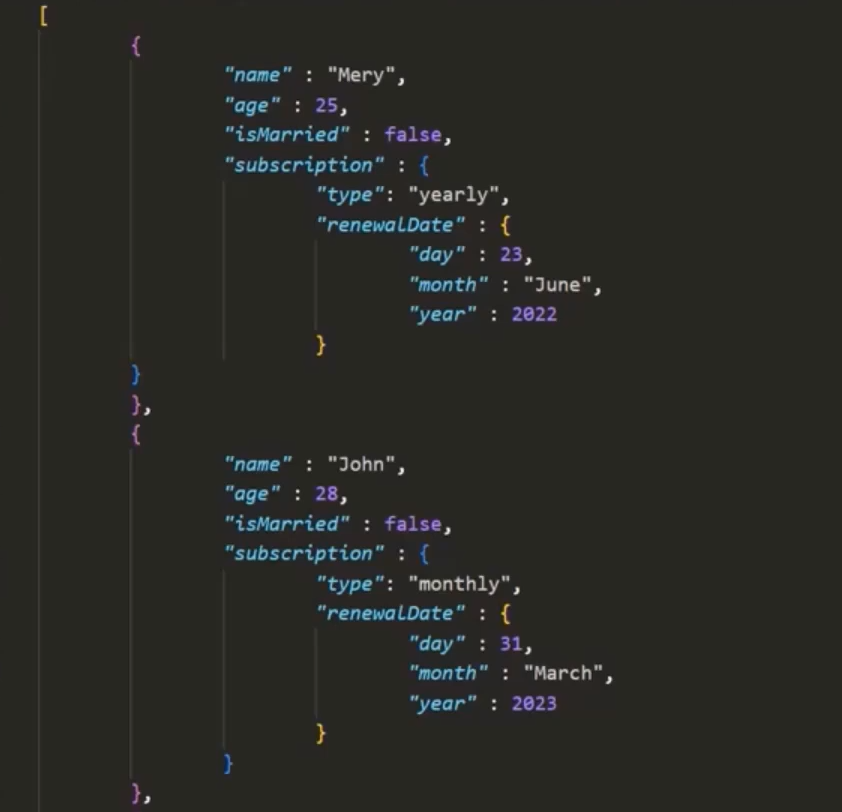

# Embedded/Nested Documents
- documents that are assigned to fields inside a document
- you can nest document up to 100 levels

- the subscription and renewalDate fields are assigned a document
- these document are embedded/nested documents
- the documents have two levels of nesting
- keep in mind the overall size of the entire document must not exceed 16mb

# Queries
- find all the document with a subscription type of yearly
    - `db.collectionName.find({"subscription.type": "yearly"})`
    - when using dot notation it must be wrapped in double quotes
- Update Nested document field: change the subscription type 
    - `db.collectionName.updateOne({name: 'John'}, {$set: {"subscription.type": "monthly"}})`
- Update Two Level nested document field: change the year
    - `db.collectionName.updateOne({name: 'John'}, {$set: {"subscription.renewalDate.year": 2026}})`
- Access value of nested document field: get the renewal month of John
    - `db.collectionName.findOne({name: 'John'}).substricption.renewalDate.month`