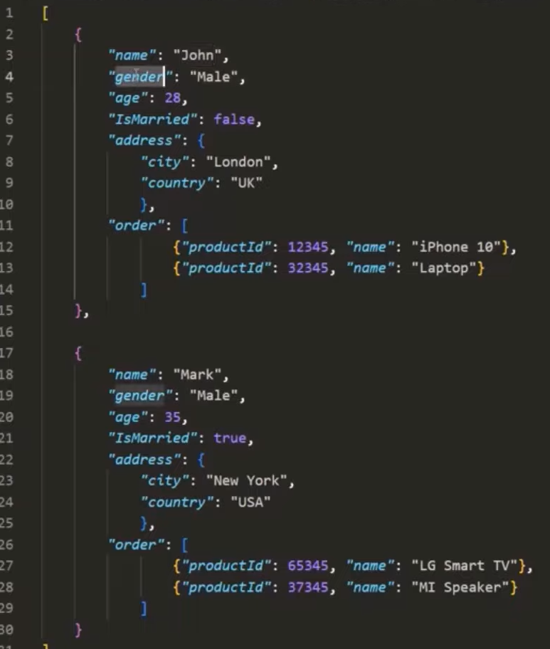

# JSON vs BSON

## JSON(JavaScript Object Notation)
- text based
- data is stored in `"key": value` pairs
- values can be string, number boolean, array, null, undefined or a nested JSON document
- uses UTF-* String encoding so, both humans and machines can easily read it
- popular format for storing and exchanging data between software systems

 

## BSON(Binary JavaScript Object Notation)
- Binary JSON is a superset of JSON
- uses Binary encoding so, only machines can read it
- supports all the data types that JSON supports plus, Integer, float, long, decimal128,date, raw binary
- MongoDB stores data in BSON internally on the disk
- BSON is the serialization format used in MongoDB
- we dont need to learn BSON because as developers we still use JSON format and MongoDb takes care of converting it to BSON and saving it to the disk
    - in the JSON file you can use the additional data types provided by BSON but you do not have to worry about the internal BSON format. MongoDB takes care of it
### Why BSON
- **Additional Data Types** BSON supports all the data types that JSON supports plus, Integer, float, long, decimal128,date, raw binary
	- JSON only support a limited number of basic data types(string, boolean, number, array)
	- we can use BSON data types with our JSON objects, JSON does not understand it but BSON does, the `ObjectId()` is an example

- **Faster** storing and fetch BSON data is faster and more efficient
- JSON is a texted based format and parsing it is very slow, but database engines should be fast, so MongoDB uses BSON

# Basic Data Types
- strings: "hello"
- boolean: true/false
- Embedded Documents
- Arrays
## Numbers
- MongoDB Shell is based on JS and JS does not diffrentiate between numbers and floating Point values
	- every number will be stored as a 64 bit floating point number in the mongodb shell
	- `{age:22}`, 22 will be stored as a floating point number not as integer
	- `typeof db.collectionName.findOne().age`data type will be returned as a number
- NumberInt(Int32): integer value up to 32 bits long  
- NumberLong(Int64): integer value up to 64 bits long
- NumberDecimal: decimals
- ObjectID: special object automatically generated by MongoDB to give you a unique ID
	- this unique ID contains a random string and a temporal componenet
	- there is a sorting built on to this ID because of the timestamp it was created on
## Date
- ISODate: date
	- `new Date()`: current date and time
- Timestamp: used mostly internally, but you can use it
	- `new Timestamp()`: current time

- `db.stats()`: utility operator that give us the stats of a db
	- gives info such as number of collections, total size, average object size etc.....