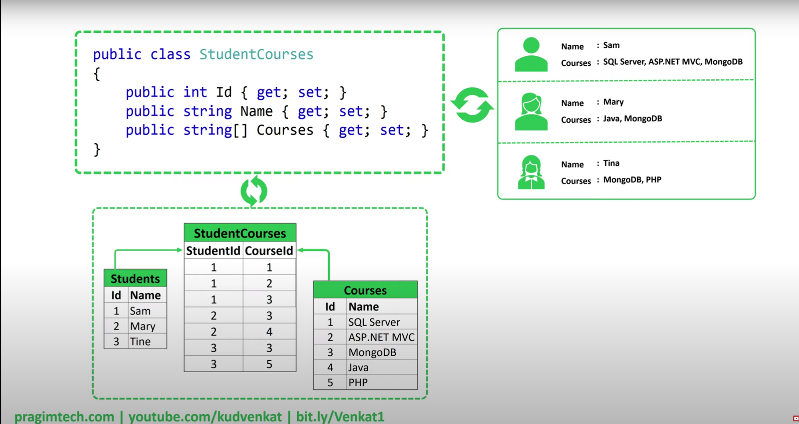

# SQL: Relational Database
- SQL makes it difficult to map application layer objects to database tables and rows
- there is a lot of misalignment between application classes and database tables, because application objects are not tables and rows
- we can write custom mapping layer or use ORMs(object relatinal mappers), like Entity Framework
- we want to reduce all this complexity and use of additional softwares so we need a database that is easy to use with our application code
- most only allow vertical scaling/scaling up/adding more resources such as memory, storage etc..., but you have to shut the DB down to add more 
    - adding more hardware(memory, storage, CPU) to a single server

# NoSQL: Non Relational Database
- Easy to use data model
- Flexible Schema
Feature rich query language
- NoSQL stands for not only SQL
    - means a non relational database is a non-tabular database
    - stores data differently than a relational tables
- Types of Non Relational databases:
    - **Documents:** such as MongoDB, CouchDB
    - **Key-Value:** such as DynamoDB, Redis
    - **Wide-Column store:** such as HBase, Cassandra
        - stores data in rows and columns but, the columns are dynamic and each row does not have to have the same column
    - **Graph Database:** such as Dgraph, OrientDB
        - to store and navigate relationships, no limit to the kind and number of relationships
        - heavily used in fraud detection and social networking
        - easy to create relationships
- the same data that requires three tables in a Relational database, can be stored in a single collection in MongoDB

- this data is easy to work with because we do not have to use complex code to access it like, complex joins and mapping layers
- application code will be cleaner, simpler and easy to maintain
- we can define relationships or references between documents and we can normalize schema just like a relational database but this is usually kept to an absolute minimum
    - if you need to do this then why use a non relational database
- in most cases we embed JSON documents inside another document, so we can have all the data we need to use in one place, without having to transverse mutiple documents
- if you have a very large data set with complex structure and relationships embedding might not create clear enough relationships so you may need to use a relational database
- supports horizontal scaling/ scaling out, data is partitioned and distributed across many servers
    - adding more machines to the available pool of machines
    - there is no need to turn off existing servers to add a new server to the pool, so no downtime

